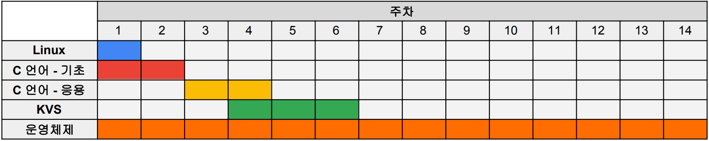

# DataLab 학부생 트레이닝

본 코스는 DataLab의 학부연구생들을 위한 코스로, 다음과 같은 효과를 얻기 위해 준비되었습니다.

* C/C++ 언어 프로프래밍 기초 및 응용 실습
* 컴퓨터 운영체제에 대한 기초 지식 습득 및 실습 진행

준비한 코스를 성실히 수행하신 뒤에는 DataLab에서 진행하고 있는 연구에 대하여 큰 범위에서 이해하실 수 있으실 것으로 기대합니다.

여기서 배운 지식을 바탕으로 향후 더욱 재미있게 연구를 진행하시게 되시길 바랍니다.

저희가 준비한 코스는 다음과 같이 총 다섯 가지로 구성됩니다.

* 내 친구 Linux
* 아주 쉬운 C 언어 - 기초
* 생활 속 C 언어 - 응용
* 빠르고 간단한 데이터 저장소 KVS
* 컴퓨터는 어떻게 동작할까, 운영체제

## 코스 소개

### 1. 내 친구 Linux

* 개요
  * DataLab에서는 대부분의 개발 및 실험을 Linux 운영체제에서 수행합니다. Linux 환경에 익숙해지기 위해 환경 설정 방법 및 기본 명령어들을 익힙니다.

* 내용
  * Windows에서 WSL 활용하여 Linux 설치
  * cd, ls와 같은 기본적인 Linux 명령어 습득
  * 간단한 C 프로그래밍 작성 및 실행

* 예상 소요기간
  * 1~3일

* [Simple Linux](https://docs.google.com/document/d/1eH3z7sfj2eg4EC5Q3PzU6ystnFk-p8U07RppF09FOT4/edit?usp=sharing)

### 2. 아주 쉬운 C 언어 - 기초

* 개요
  * 시스템 개발에 기초가 되는 C 언어를 학습하고 간단한 응용 프로그램을 개발합니다.

* 내용
  * 포인터, 구조체 등과 같은 기초적인 C 언어 문법 학습
  * 파일 I/O, `mmap()` 등 시스템 개발에서 자주 사용하는 함수 실습
  * 다양한 탐색 알고리즘 구현을 통한 기초 알고리즘 학습

* 예상 소요기간
  * 1~2주

* 실습자료 업데이트 예정

### 3. 생활 속 C 언어 - 응용

* 개요
  * 앞서 배운 C 언어 기초를 이용하여 실생활에서 활용 가능한 프로그램을 개발합니다.

* 내용
  * 사전 탐색 프로그램 개발
  * 카카오톡 채팅 분석 프로그램 개발

* 예상 소요기간
  * 1~2주

* 실습자료 업데이트 예정

### 4. 빠르고 간단한 데이터 저장소 KVS

* 개요
  * Key-value Store (KVS)는 우리가 사용하는 데이터를 저장할 수 있는 소프트웨어입니다. 여러 자료구조들을 사용해서 KVS를 구현해보고 알고리즘 특성에 따른 성능 차이를 확인해볼 수 있습니다.

* 내용
  * 여러 자료구조(list, hash, tree 등)을 사용하여 데이터 저장 알고리즘 구현
  * 각 알고리즘에 따른 성능 평가 및 분석

* 예상 소요기간
  * 1~2주

* [cheeze_kvs](https://github.com/dgist-datalab/cheeze_kvs)

### 5. 컴퓨터는 어떻게 동작할까, 운영체제

* 개요
  * 운영체제는 하드웨어로 구성된 컴퓨터가 동작할 수 있게하는 가장 기초적인 소프트웨어 입니다. 다양한 하드웨어 자원을 관리하고 컴퓨터 이용자에게 편의성을 제공하는 운영체제에 대하여 학습합니다.

* 내용
  * CPU, Memory, Consistency, Persistence에 대한 지식 습득
  * 배운 내용에 대한 다양한 실습을 통해 이해 증진

* 예상 소요기간
  * 14주

* [undergraduate-ostep](https://github.com/dgist-datalab/undergraduate-ostep)

## [전체 타임라인](https://docs.google.com/spreadsheets/d/1gwsb9MsN-_fvRr794P3vfc1kptT6AxkW3lVkixxWKjs/edit?usp=sharing)

